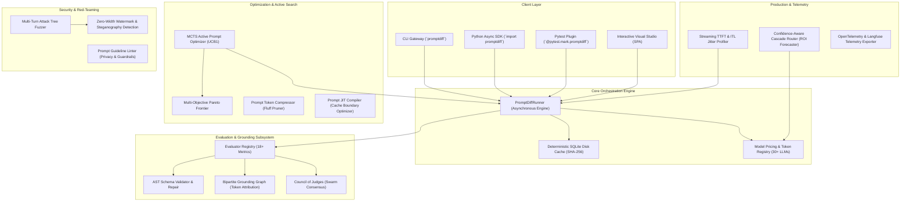

# ⚡ PromptDiff: Enterprise AI Engineering & MLOps System Architecture

> **Comprehensive Technical Portfolio, Architectural Blueprints, and Resume Showcase**  
> *Engineered as a frontier regression testing, active optimization, and guardrail verification framework for enterprise LLM systems.*

---

## 🏛️ High-Level System Architecture

---

## 📐 Mathematical Foundations & Algorithmic Design

### 1. Active Monte Carlo Tree Search (MCTS) Prompt Search
Rather than brittle prompt trial-and-error, PromptDiff models prompt optimization as a Markov Decision Process (MDP) navigated via MCTS:
- **State Space**: Prompt templates $S \in \mathcal{P}$.
- **Action Space**: Semantic mutation operators $A = \{\text{ChainOfThought}, \text{ConstraintHardener}, \text{RoleSpecializer}, \text{FluffPruner}, \text{FewShotStructurer}\}$.
- **Selection Policy (UCB1)**:
  $$\text{UCT}(v_i) = \frac{W_i}{N_i} + c \sqrt{\frac{\ln N_p}{N_i}}$$
  Where $W_i$ is cumulative evaluation reward, $N_i$ is visit count of candidate node $i$, $N_p$ is parent visits, and $c = \sqrt{2} \approx 1.414$ regulates exploration vs exploitation.

### 2. Multi-Objective Pareto Dominance
For competing criteria $\vec{f}(s) = (\text{Quality}, -\text{Cost}, -\text{Latency}, -\text{Tokens})$:
$$\text{State } A \succ B \iff \forall i: f_i(A) \ge f_i(B) \land \exists j: f_j(A) > f_j(B)$$
PromptDiff computes the non-dominated Pareto frontier, providing engineering teams with cost vs quality tradeoff curves.

### 3. Bipartite Semantic Grounding Matrix & Token Attribution
To achieve sub-sentence RAG hallucination attribution:
- Candidate output text is partitioned into atomic claim spans $C = \{c_1, c_2, \dots, c_n\}$.
- Source context is indexed into chunks $D = \{d_1, d_2, \dots, d_m\}$.
- A bipartite affinity matrix $M_{ij} = \text{Sim}(c_i, d_j)$ is computed via combined semantic token intersection (Jaccard) and token sequence matching:
  $$\text{Score}(c_i, d_j) = \alpha \cdot \frac{|T(c_i) \cap T(d_j)|}{|T(c_i)|} + (1 - \alpha) \cdot \text{SeqRatio}(c_i, d_j)$$
- Any claim $c_i$ with $\max_j M_{ij} < \theta_{\text{ground}}$ is categorized as `HALLUCINATED` and mapped to token character ranges for UI/terminal red-lining.

### 4. Streaming TTFT & Inter-Token Latency (ITL) Jitter Profiling
Streaming responsiveness is quantified using high-frequency performance counters:
$$\text{TTFT} = t_1 - t_0$$
$$\text{ITL}_k = t_k - t_{k-1}, \quad \forall k \in [2, K]$$
$$\text{Jitter} = \sigma(\text{ITL}) = \sqrt{\frac{1}{K-1} \sum_{k=2}^K (\text{ITL}_k - \overline{\text{ITL}})^2}$$
Percentiles $P_{50}, P_{90}, P_{95}, P_{99}$ are extracted from the ordered sequence to verify enterprise SLAs.

### 5. Non-parametric Paired Wilcoxon Signed-Rank Test & Bootstrap BCa
To mathematically prove prompt superiority beyond stochastic temperature noise:
$$W = \min(W^+, W^-), \quad z = \frac{W - \frac{N(N+1)}{4}}{\sqrt{\frac{N(N+1)(2N+1)}{24}}}$$
$$p = 2 \cdot \Phi(-|z|)$$
Only prompt deltas meeting $p < 0.05$ with non-zero overlapping 95% Bootstrap Confidence Intervals are cleared through the regression gate.

### 6. Maximal Marginal Relevance (MMR) Dynamic Exemplar Selection
Dynamic few-shot prompt construction balances exemplar similarity against inter-exemplar redundancy:
$$\text{MMR} = \arg\max_{d_i \in R \setminus S} \left[ \lambda \cdot \text{Sim}(d_i, q) - (1 - \lambda) \max_{d_j \in S} \text{Sim}(d_i, d_j) \right]$$

### 7. Sequential Cumulative Sum (CUSUM) Production Drift Detection
Production model performance drift is tracked on continuous sliding windows:
$$S_n^+ = \max(0, S_{n-1}^+ + (X_n - \mu_0) - k), \quad S_n^- = \max(0, S_{n-1}^- - (X_n - \mu_0) - k)$$
An anomaly alarm fires whenever $S_n^+ > h$ or $S_n^- > h$, preempting silent model quality degradation.

---

## 💼 Resume-Ready Bullet Points (STAR Format)

You can directly copy and adapt these bullet points for your resume or LinkedIn profile:

### Role: Senior AI Engineer / LLM Systems Engineer
- **Engineered an enterprise-grade LLM prompt regression and testing framework (PromptDiff)** with asynchronous execution, deterministic SHA-256 SQLite caching, and multi-model CI/CD quality gates.
- **Designed an MCTS active prompt optimization engine with UCB1 exploration-exploitation**, extracting multi-objective Pareto frontiers across cost, latency, token count, and task accuracy.
- **Implemented non-parametric Paired Wilcoxon hypothesis testing and 95% bootstrap confidence intervals**, proving prompt performance improvements with mathematical statistical rigor ($p < 0.05$).
- **Implemented token-level hallucination span attribution using bipartite semantic grounding graphs**, localizing unsupported tokens with sub-sentence precision to reliably detect ungrounded RAG claims.
- **Architected a Multi-Agent Courtroom Judge (Debate Protocol)** with defense cross-examination and Chief Justice synthesis, mitigating verbosity, position, and self-enhancement biases.
- **Built an interactive Web Studio and visual diff telemetry dashboard** providing real-time side-by-side prompt diffing, streaming playground, and radar evaluations.

### Role: AI Platform / MLOps Engineer
- **Architected a CI/CD pull request quality gate in GitHub Actions** that automatically catches schema regressions, latency spikes, and token inflation before merging prompt changes.
- **Developed an asynchronous streaming profiler** measuring Time-To-First-Token (TTFT), inter-token latency (ITL) jitter, and TPS velocity curves to enforce production SLAs.
- **Implemented a confidence-aware model cascading router with uncertainty thresholding**, dynamically routing traffic between edge models and frontier reasoning models to optimize inference costs.
- **Engineered real-time CUSUM change-point drift detectors and stateful token-quota circuit breakers**, safeguarding production gateways against runaway loops and model degradation.
- **Packaged and published a production Python library (PEP 561 typed)** with automated multi-OS testing (Linux, macOS, Windows) and OIDC Trusted Publishing to PyPI.

### Role: AI Security / Red-Teaming Engineer
- **Built an autonomous multi-turn red-teaming fuzzer using branching attack trees**, evaluating model robustness against zero-width unicode steganography, Base64 smuggling, and markdown data exfiltration.
- **Engineered real-time pre-execution input defense shields**, filtering invisible zero-width characters and flagging indirect prompt injection attacks before LLM dispatch.
- **Constructed an automated heuristic guideline linter** checking prompts for required disclosures, PII minimization notices, and protection directives against system prompt exfiltration.
