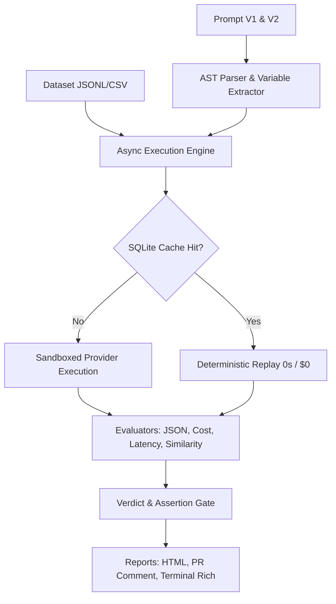

# Architecture Deep-Dive

PromptDiff is engineered with a **local-first, zero-cloud exfiltration, deterministic execution** architecture.

---

## Core Engineering Principles

### 1. Deterministic Caching
Every evaluation request (prompt template + interpolated variables + model parameters) is fingerprinted via SHA-256:
- Cache keys are content-addressed.
- Cached results execute in < 1ms at \$0 cost.
- Database runs on SQLite with Write-Ahead Logging (`PRAGMA journal_mode=WAL`) and `busy_timeout` handling for safe concurrent CI workers.

### 2. AST-Level Difference Engine
Unlike standard line diffing tools (`wdiff` or `git diff`) which only look at raw strings, PromptDiff parses prompt templates into Abstract Syntax Trees:
- Identifies structural changes (e.g. Jinja2 conditional branches, loop modifications, variable scope alterations).
- Distinguishes cosmetic whitespace modifications from semantic logic mutations.

### 3. Model Pricing Registry & Offline Tokenization
- Offline BPE token calculation using `tiktoken` (for OpenAI) and character/word approximations for Anthropic & Gemini.
- Synchronized model pricing registry with input/output token costs across 30+ providers.
- Computes exact financial deltas and forecasts monthly cost changes based on traffic assumptions.

---

## Detailed System Design

For extended mathematical formulations, Bayesian Bradley-Terry rankings, and low-level subsystem diagrams, see [PORTFOLIO.md](https://github.com/latryee/promptdiff/blob/main/PORTFOLIO.md).
